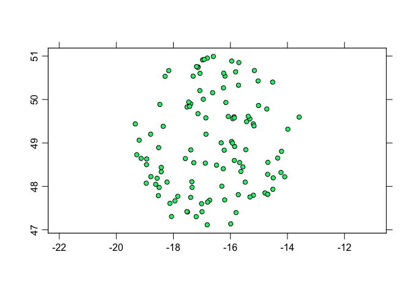
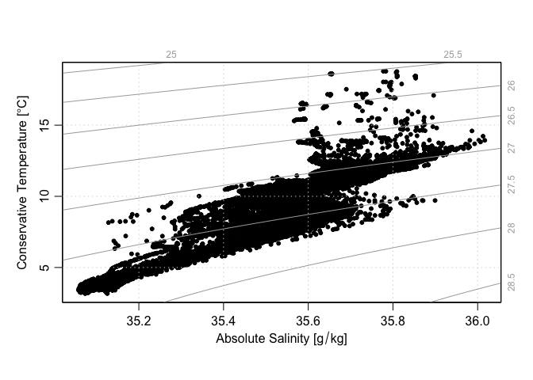
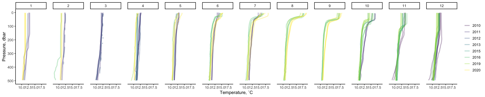

Exploring ARGO data
================
Nicholas Baetge
3/4/2021

This project pulls
[synthetic](https://argo.ucsd.edu/data/data-faq/#RorD) ARGO data from
the
[web](http://www.argodatamgt.org/Access-to-data/Access-via-FTP-or-HTTPS-on-GDAC)
using the argoFloats package, which is still developing but is super
sweet. That package can be found
[here](https://argocanada.github.io/argoFloats/index.html) Data are then
extracted from nested lists into a dataframe to ease exploration via
ggplot.

# Libraries

``` r
library(oce)
```

    ## Loading required package: gsw

    ## Loading required package: testthat

    ## Error in get(genname, envir = envir) : object 'testthat_print' not found

``` r
library(ocedata)
```

    ## Warning: package 'ocedata' was built under R version 4.0.2

``` r
# library(devtools)
#    install_github('dankelley/argoFloats', ref='develop')
library(argoFloats)
library(ncdf4)
```

    ## Warning: package 'ncdf4' was built under R version 4.0.2

# Download and Index

``` r
synthetic <- getIndex("synthetic", destdir = "~/GITHUB/argo/synthetic_data/")

from <- as.POSIXct("2020-03-01", tz = "UTC")
to <- as.POSIXct("2021-03-07", tz = "UTC")
subset.geo <- subset(synthetic, circle = list(longitude = -16.5, latitude = 49, radius = 222 )) 
```

    ## Kept 114 profiles (0.0528%)

``` r
subset.time <- subset(subset.geo, time = list(from = from, to = to))  
```

    ## Kept 17 profiles (14.9%)

# Plot Float Locations

``` r
plot(subset.geo, bathymetry = FALSE, mar = par("mar"),  asp = 1 / cos(mean(range(unlist(subset.geo[["latitude"]]), na.rm = TRUE))*pi/180),  mgp = getOption("oceMgp"))
```

<!-- -->

# Download and QC Indexed Profiles

``` r
profiles <- getProfiles(subset.geo, destdir = "~/GITHUB/argo/synthetic_data/")
argos <- readProfiles(profiles, destdir = "~/GITHUB/argo/synthetic_data/")
```

    ## Warning in readProfiles(profiles, destdir = "~/GITHUB/argo/synthetic_data/"): Of 114 profiles read, 26 have >10% of BBP700 values with QC flag of 4, signalling bad data.
    ##     The indices of the bad profiles are as follows.
    ##     1 2 3 4 5 6 7 8 9 10 11 12 13 14 15 16 17 18 19 20 21 22 23 24 25 26

    ## Warning in readProfiles(profiles, destdir = "~/GITHUB/argo/synthetic_data/"): Of 114 profiles read, 26 have >10% of CDOM values with QC flag of 4, signalling bad data.
    ##     The indices of the bad profiles are as follows.
    ##     1 2 3 4 5 6 7 8 9 10 11 12 13 14 15 16 17 18 19 20 21 22 23 24 25 26

    ## Warning in readProfiles(profiles, destdir = "~/GITHUB/argo/synthetic_data/"): Of 114 profiles read, 26 have >10% of chlorophyllA values with QC flag of 4, signalling bad data.
    ##     The indices of the bad profiles are as follows.
    ##     1 2 3 4 5 6 7 8 9 10 11 12 13 14 15 16 17 18 19 20 21 22 23 24 25 26

    ## Warning in readProfiles(profiles, destdir = "~/GITHUB/argo/synthetic_data/"): Of 114 profiles read, 26 have >10% of nitrate values with QC flag of 4, signalling bad data.
    ##     The indices of the bad profiles are as follows.
    ##     1 2 3 4 5 6 7 8 9 10 11 12 13 14 15 16 17 18 19 20 21 22 23 24 25 26

    ## Warning in readProfiles(profiles, destdir = "~/GITHUB/argo/synthetic_data/"): Of 114 profiles read, 73 have >10% of oxygen values with QC flag of 4, signalling bad data.
    ##     The indices of the bad profiles are as follows.
    ##     1 2 3 4 5 6 7 8 9 10 11 12 13 14 15 16 17 18 19 20 21 22 23 24 25 26 27 28 29 30 31 32 33 34 35 36 37 38 39 40 41 42 43 44 45 46 47 48 49 50 51 52 53 54 55 56 57 58 59 60 61 62 63 64 65 66 67 68 69 70 71 72 105

    ## Warning in readProfiles(profiles, destdir = "~/GITHUB/argo/synthetic_data/"): Of 114 profiles read, 22 have >10% of salinity values with QC flag of 4, signalling bad data.
    ##     The indices of the bad profiles are as follows.
    ##     6 7 8 9 10 11 12 13 14 15 16 17 18 19 20 21 22 23 24 25 26 105

``` r
argosClean <- applyQC(argos) #fills flagged bad data with "NA"
```

# Plot T-S

``` r
plot(argosClean, which = "TS")
```

<!-- -->

# Extract Data from Nested Lists

``` r
library(tidyverse)
```

    ## Warning: package 'tidyverse' was built under R version 4.0.2

    ## ── Attaching packages ──────────────────────────────────────────────────────────────────────────────────────────────── tidyverse 1.3.0 ──

    ## ✓ ggplot2 3.3.0     ✓ purrr   0.3.4
    ## ✓ tibble  3.0.1     ✓ dplyr   1.0.4
    ## ✓ tidyr   1.0.3     ✓ stringr 1.4.0
    ## ✓ readr   1.3.1     ✓ forcats 0.5.0

    ## Warning: package 'dplyr' was built under R version 4.0.2

    ## ── Conflicts ─────────────────────────────────────────────────────────────────────────────────────────────────── tidyverse_conflicts() ──
    ## x dplyr::filter()  masks stats::filter()
    ## x purrr::is_null() masks testthat::is_null()
    ## x dplyr::lag()     masks stats::lag()
    ## x dplyr::matches() masks tidyr::matches(), testthat::matches()

``` r
library(lubridate)
```

    ## 
    ## Attaching package: 'lubridate'

    ## The following objects are masked from 'package:base':
    ## 
    ##     date, intersect, setdiff, union

``` r
list <- argosClean@data$argos

getdata <- function(i){x <- i@data }

getnames <- function(i){x <- i@metadata$filename
y <- gsub("/Users/nicholasbaetge/GITHUB/argo/synthetic_data/", "", x)
z <- gsub(".nc", "", y)}

data <- lapply(list, getdata)
names <- lapply(list, getnames )

names(data) <- names

convert <- function(i) {
   cols <- names(i)
   i$time <- as.character(i$time)
   b <- as.data.frame(do.call("cbind", i))
   colnames(b) <- cols
   c <- b %>% 
  mutate_at(vars(-time), as.numeric) %>% 
  mutate(date = ymd_hms(time),
         year = year(date),
         month = month(date)) %>% 
  select(date, year, month, everything(), -time)
  }

data.convert <- lapply(data, convert)

tidied <- plyr::ldply(data.convert, data.frame) %>% 
  separate(.id, into = c("float", "profile"), sep = "_") 
```

# Plot Profiles

``` r
library(viridis)
library(ggpubr)

tidied %>% 
  filter(pressureAdjusted < 500) %>%
  ggplot(aes(x = pressureAdjusted, y = temperatureAdjusted, group = interaction(float, profile))) +
  facet_grid(~as.factor(month)) +
  geom_line(aes(color = as.factor(year)), size = 2, alpha = 0.3) +
  labs(x = "Pressure, dbar", y = "Temperature, ˚C", color = "Year") +
  # expand_limits(x = 200) +
  scale_x_reverse() +
  coord_flip() +
  scale_color_viridis_d() +
  # guides(colour = F, fill = F, shape = F, linetype = F) +
  theme_classic2(base_size = 20) +
  theme(legend.title = element_blank(),
        panel.spacing.x = unit(1, "cm"),
        axis.text.x = element_text(angle = 0),
        legend.key.size = unit(1, "cm"))
```

<!-- -->
